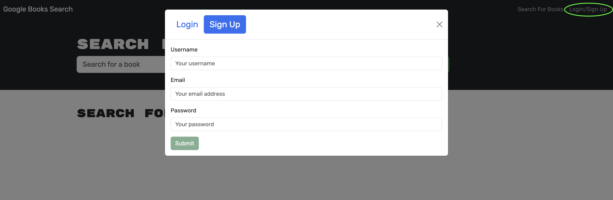

# ***Book Search Engine*** 

 

## Overview
This is an app for that will help your search for new books to read. Selections are saved to a user's profile for future reference.
 

## Application Instructions
Visit https://immense-anchorage-91218-076f9606ff01.herokuapp.com/ and sign-up or log-in to start selecting your next books to read!
 

## Static Screen-Captures of the Application
<h4>ONLINE</h4>

##

##

## Contributors To This Application
Kevin Lewis

 

# ***Thank you for using this App!*** 

## Questions? Contact the Developer on GitHub... 
KPL33
## ...or via Email
kevinsname2003@yahoo.com